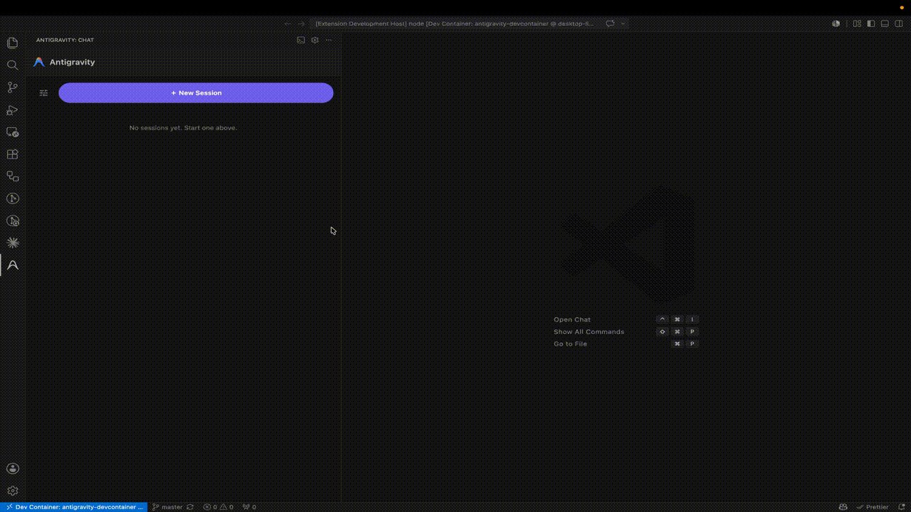

# Antigravity for VS Code

Bring Google's **Antigravity CLI** (`agy`) into VS Code — an agentic coding
companion with a **Material 3 Expressive** chat panel, a slash‑command
navigator, interactive sessions, and Google sign‑in.

This is the VS Code counterpart to Antigravity's own IDE and CLI, in the same
spirit as the Claude Code marketplace extension: the editor provides the UI; the
official CLI does the work. The extension never bundles the CLI — it drives the
`agy` binary you install locally.

> **Unofficial / community extension.** Not affiliated with or endorsed by
> Google. "Antigravity" and "Gemini" are trademarks of Google LLC.



---

## Features

| Surface | What it does |
| --- | --- |
| **Sessions list** | The panel opens to your saved sessions — open one, delete one, or start a new session. The options menu beside **New Session** launches it **sandboxed** or with **permissions bypassed**. A session with a turn in flight shows a loading indicator in its row. |
| **Chat panel** (Material 3 Expressive webview) | Ask questions and watch the reply stream in. Each session is backed by its **own live interactive `agy` process**, so follow‑up turns keep full context; a back chevron returns to the list. |
| **Terminal mirror** | The title‑bar terminal button **toggles** a VS Code terminal mirroring the active session's *same* live process (and routes your keystrokes back) — click again to close it. The process otherwise runs hidden. |
| **Sign‑in gate** | If you aren't signed in (or the CLI isn't installed), the panel shows only a **Sign in with Google** / **Install CLI** action — the chat appears once you're ready. |
| **Slash‑command navigator** | Type `/` to browse and run all 35 real Antigravity commands (`/goal`, `/diff`, `/model`, `/permissions`, `/rewind`, `/mcp`, …), aliases included, with autocomplete. The catalog is captured from the live CLI, so it matches what `agy` actually offers. |
| **Ask About Selection** | Send highlighted code (with file + line context) to the agent. |
| **CLI lifecycle** | Install, update, view the changelog, and manage plugins from the command palette or the panel's overflow menu. |

## Requirements

- **VS Code** 1.90 or newer.
- The **Antigravity CLI (`agy`)** installed and signed in. The extension shells
  out to it; it does not embed it.

### Installing the CLI

Run **“Antigravity: Install CLI”**, or install it yourself:

```bash
# macOS / Linux
curl -fsSL https://antigravity.google/cli/install.sh | bash
# Windows (PowerShell)
irm https://antigravity.google/cli/install.ps1 | iex
```

The installer drops `agy` into `~/.local/bin` (Unix) or `%LOCALAPPDATA%\Antigravity\`
(Windows). If that directory isn't on your `PATH`, set
[`antigravity.cliPath`](#configuration) to the binary's full path.

### Signing in (required)

`agy` authenticates with a **Google account**. Click **Sign in with Google** in
the panel (or run **“Antigravity: Sign In”**); the CLI opens your browser for
the OAuth grant, or — on a remote/SSH host — prints a URL and one‑time code in
the terminal. The extension decides whether you need to sign in by **invoking
`agy` itself**: it launches the CLI and reveals the chat unless the CLI asks for
a login. No cached token is inspected, so a sign‑in done in a terminal or held in
the OS keychain counts. **Sign out** runs the CLI's `/logout`.

## Usage

1. Open the **Antigravity** view (rocket icon) or press
   <kbd>Ctrl/Cmd</kbd>+<kbd>Alt</kbd>+<kbd>A</kbd>. You'll see your **sessions
   list**; click **＋ New Session** or an existing one. The back chevron returns here.
2. Type a prompt and press <kbd>Enter</kbd> (<kbd>Shift</kbd>+<kbd>Enter</kbd>
   for a newline). The single round button **sends**, and turns into an orange
   **stop** while a turn runs (it presses *esc* in the live session). The
   terminal button **toggles** the *same* live session in a terminal.
3. Type `/` to open the **slash‑command navigator**; ↑/↓ to move, <kbd>Enter</kbd>/<kbd>Tab</kbd>
   to pick. Most commands are forwarded to the session's live `agy` (where they
   actually work); a few — `/clear`, `/help`, `/logout`, `/changelog` — are
   handled natively.
4. Need room for a long prompt? Click the **expand** icon to turn the composer
   into a full‑panel editor, and again to collapse.
5. To work on a snippet, select code and run **Ask About Selection**
   (<kbd>Ctrl/Cmd</kbd>+<kbd>Alt</kbd>+<kbd>K</kbd>).

> **Note:** `agy` is a full agentic coding agent — it may read your project and
> run tools to answer, so a turn can take a while on complex prompts. Use the
> stop button (esc) to cancel, or open the terminal mirror to watch/steer it.

### Configuration

| Setting | Default | Description |
| --- | --- | --- |
| `antigravity.cliPath` | `agy` | Binary name (resolved on `PATH`) or an absolute path. |
| `antigravity.skipPermissions` | `false` | Pass `--dangerously-skip-permissions` (auto‑approve all tool actions). |
| `antigravity.sandbox` | `false` | Pass `--sandbox` (terminal restrictions). |
| `antigravity.autoAddWorkspaceFolders` | `true` | Add the *extra* roots of a multi‑root workspace via `--add-dir` (the primary folder is the working dir and is always visible). |
| `antigravity.installCommand` | *(install.sh)* | Command used by *Install CLI*. |

## Development

```bash
npm install         # install dev dependencies
npm run check-types # strict TypeScript type-check
npm run compile     # bundle to dist/extension.js (esbuild)
npm test            # build + run the unit/integration suite (Mocha)
```

Press <kbd>F5</kbd> to launch an Extension Development Host. The test suite runs
on Node against a **stub CLI** (`test/fixtures/agy-stub.js`) — no real `agy`,
network, or Google login required. See [docs/ARCHITECTURE.md](docs/ARCHITECTURE.md)
for the internal design.

## License

MIT.
